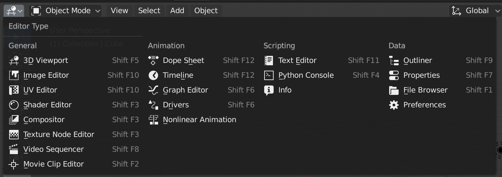
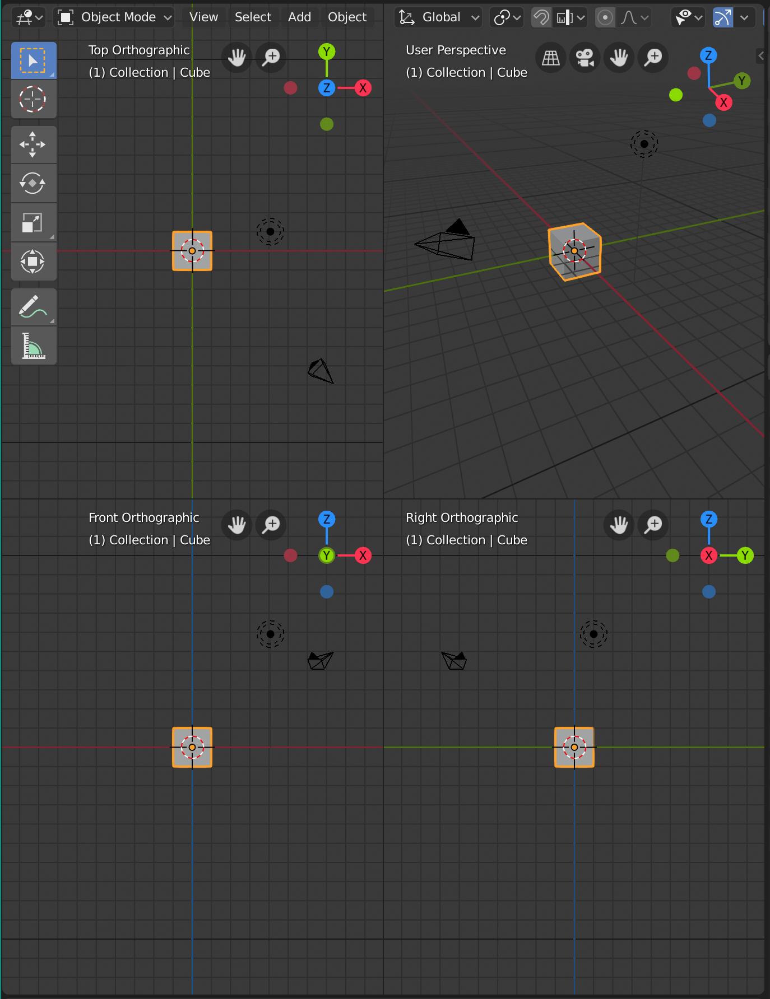

# Interfész - 1. rész

!!! info "Friss tartalom"
    Ez a tartalom a Blender 2.8-as vagy annál frissebb verziójához készült!

**_A lecke hossza 31 percnyi videó + gyakorlás és feladatok ~1 óra_**

!!! info ""
    Ez az oktatóanyag **Ferenczi Róbert Magyar Blender 2.8 Tutoriál sorozat**ának első része alapján készült, azt kiegészítve a könnyebb kereshetőséget segítő linkekkel, a gyorsgombok gyűjteményével és néhány feladattal. Ha a leckével kapcsolatban bármi kérdésed vagy észrevételed lenne, írj a daniel.hegedus@schdesign.hu email címre, valamint ne felejtsd el likeolni a YouTube videót!

<iframe width="560" height="315" src="https://www.youtube.com/embed/G8zrru587Yc" frameborder="0" allow="accelerometer; autoplay; encrypted-media; gyroscope; picture-in-picture" allowfullscreen></iframe>

!!! info "Használt jelölések"
    - gyorsgombok: ``Ctrl + Alt + Q``
    - menüpontok / eszközök nevei angolul: **Grab**
    - menüpontok / eszközök nevei magyarul: _Mozgatás_

## Kezdőknek

!!! info "Használati utasítás"
    Először nézzétek végig a videót, majd utána fussátok át a jegyzetet, és ellenőrizzétek, hogy mennyi tudás maradt meg. Próbáljátok meg begyakorolni a jelenet körbejárásának, és az alap transzformációknak a gyorsgombjait!

### Felhasználói felület &rarr; https://youtu.be/G8zrru587Yc?t=43

### Panelek
#### Panelek átrendezése, törlése, új panel létrehozása &rarr; https://youtu.be/G8zrru587Yc?t=109

- átrendezés  &rarr; ``bal egérgomb`` bal a szélükre kattintva
- törlés      &rarr; ``jobb egérgomb``, majd **Join Area**
- létrehozás  &rarr; ``jobb egérgomb``, majd **Split Area**

#### Panelek tartalmának megváltoztatása  &rarr; https://youtu.be/G8zrru587Yc?t=171

#### Panelelrendezés lementése, alap panel-elrendezés visszatöltése &rarr; https://youtu.be/G8zrru587Yc?t=205

- **File** &rarr; **Defaults** &rarr; **Save Startup File**
- **File** &rarr; **Defaults** &rarr; **Load Factory Settings** (Ettől még nem mentődik vissza ez alapbeállításnak, ahhoz újra a **Save Startup File**-ra kell nyomni)

### Üzemmódok váltása (**Workspace**-ek) &rarr; https://youtu.be/G8zrru587Yc?t=255

- **Layout**          &rarr; jelenet berendezéséhez
- **Modeling**        &rarr; Modellezés üzemmód, modellek szerkesztése
- **Sculpting**       &rarr; Szobrász üzemmód
- **UV Editing**      &rarr; UV-zás (testek 2D-be kiterítés)
- **Texture Paint**   &rarr; Textúra festés
- **Shading**         &rarr; Anyagok létrehozása (csomópont alapú)
- **Animation**       &rarr; Animáció szerkesztő üzemmód
- **Rendering**       &rarr; Renderek megtekintése
- **Compositing**     &rarr; 2D és 3D ötvözése
- **Scripting**       &rarr; Python-os programozási felület

### Viewport nézet módjai &rarr; https://youtu.be/G8zrru587Yc?t=527

A viewport nézetek közt a ``Z`` gyorsgomb segítségével lehet váltani.

)

- **Wireframe**  – drótvázas nézet
- **Solid**  – munka nézet
  - **MatCap** &rarr; jobban láthatóvá teszi bizonyos részeit
  - **Cavity** &rarr; élek kiemelése
  - **Shadow** &rarr; árnyékok
  - **Shadeless** &rarr; árnyalás nélkül látszódjon a textúra
- **LookDev**   – EEVEE engine alatt - PBR anyagokat mutat
- **Rendered**  – Render nézet
  - render engine váltás
  - **EEVEE** – gyorsabb
  - **Cycles** – fotorealisztikusabb, picit lassabb
    - GPU bekapcsolása &rarr; https://youtu.be/G8zrru587Yc?t=656
    - 

Opcionális beállítás: https://youtu.be/G8zrru587Yc?t=710 &rarr; kijelölt objektum körüli forgatás bekapcsolása/kikapcsolása
- **Edit** &rarr; **Preferences** &rarr; **Navigation** &rarr; **Orbit Around Selection**

### Viewport irányítása &rarr; https://youtu.be/G8zrru587Yc?t=757

!!! warning ""
    Ennek a fejezetnek ez az egyik legfontosabb része, ezt elengedhetetlen tudni a továbbiakban!

- _Objektum kijelölése_ &rarr; ``Bal egérgomb``
- _Nézet forgatása_ &rarr; ``Középső egérgomb`` / gizmóval
- _Nézet oldalaztatása_ (**pan**) &rarr; ``Shift + Középső egérgomb``
- _Zoomolás/nagyítás_ &rarr; ``Középső egérgomb görgetése``
- _Nézet átállítása a kijelölt objektumra_ &rarr; ``NUM DEL``
warning 
(JEGYEZDMEG: ha gyanúsan nem megy a zoom, vagy elvesztél a jelenetben, akkor hasznos!)
- _Perspektívikus_ / _Ortografikus_ üzemmód közti váltás &rarr; ``NUM 5``
- Oldalsó nézetek közti váltás &rarr; ``Alt + Középső egérgombbal nézet forgatása``
  - _Előlnézet_ &rarr; ``NUM 1``
  - _Jobboldali nézet_ &rarr; ``NUM 3``
  - _Felülnézet_ &rarr; ``NUM 7``
  - Auto Perpective kikapcsolása:
    **Edit** &rarr; **Preferences** &rarr; **Navigation** &rarr; **Auto Perspective** (ezt nagyon érdemes kikapcsolni!)
- **Quad View** (fixált elől-oldalt-felül és 3d nézet) &rarr; ``Alt + Ctrl + Q``
  

### Transzformációk &rarr; https://youtu.be/G8zrru587Yc?t=959

- **Toolbar** eszközökkel
  - **Grab** – _Mozgatás_
    - gizmókra nyomva &rarr; tengelyeken mozgatás
    - kis lapra nyomva &rarr; síkban mozgatás
  - **Rotate** – _Forgatás_
    - gizmókkal &rarr; adott tengely körül
    - fehér &rarr; nézőpontból átdögött tengely körül
  - **Scale** / **Cage** – _Átméretezés_ / _Ketreccel nyújtás_
  - _Transzform gizmó_ &rarr; egyszerre a 3 transzformációhoz
- Gyorsbillentyűkkel
  - minden transzformációra
    - _Művelet visszavonása_ &rarr; ``Jobb egérgomb``
    - _Művelet elfogadása_ &rarr; ``Bal egérgomb``
    - ``Shift``-et nyomva lassabban lehet mozgatni - https://youtu.be/G8zrru587Yc?t=1459
    - (tengelyre korlátozás másik módja: https://youtu.be/G8zrru587Yc?t=1512)
      - ``G`` után ``középső egérgomb``bal irány választása
    - Lokális tengely mentén való transzformálás lokális tengelyekre váltás nélkül - https://youtu.be/G8zrru587Yc?t=1576
      - ``G + Z + Z`` &rarr; kétszer nyomva a kívánt tengelyt &rarr; tárgy lokális tengelyén mozog
      - ``S + Shift + Z + Z`` &rarr; lokális tengely mentén nyújtás
  - **Grab** – ``G`` – _Mozgatás_
    - ``X`` vagy ``Y`` vagy ``Z`` &rarr; csak az adott tengelyen
    - ``Shift + X`` vagy ``Shift + Y`` vagy ``Shift + Z`` &rarr; mozgatás az adott tengely kizárásával (síkban mozgatás)
  - **Rotate** – ``R`` – _Forgatás_ https://youtu.be/G8zrru587Yc?t=1281
    - alapeset &rarr; nézőpontból átdöfött tengely körül
    - ``X`` vagy ``Y`` vagy ``Z`` &rarr; adott tengely körül
    - szabad forgatás ``R + R``&rarr; https://youtu.be/G8zrru587Yc?t=1720
  - **Scale** – ``S`` – _Átméretezés_ - https://youtu.be/G8zrru587Yc?t=1340
    - ``X`` vagy ``Y`` vagy ``Z`` &rarr; adott tengely körül
    - ``Shift + X/Y/Z`` &rarr; átméretezés az adott tengely kizárásával (síkban nyújtás)

### Koordinátarendszerek  &rarr; https://youtu.be/G8zrru587Yc?t=1159

- **Globális** - _világ koordinátarendszer_
- **Lokális** - _lokális_, az objektumra vonatkozó koordináta rendszer

### Objektum törlése &rarr; https://youtu.be/G8zrru587Yc?t=1768

- **Delete** – _kijelölt objektum törlése_ – ``Delete`` vagy ``X``

## Haladóknak

### Transzformációk resetelése &rarr; **N-Panel** ``N`` &rarr; https://youtu.be/G8zrru587Yc?t=1210

- Transzformációk menüpont
  - **Location**, **Rotation**, **Scale** (objektum eredeti helyéhez viszonított)
  - (minden értéket vátó felületre működő parancsok)
    - Mező alapértékre állítása &rarr; felettük ``Backspace``-t nyomva
    - Több értéksáv kijelölése &rarr; *Shift*-el

### Transzformációs értékek elfogadása &rarr; https://youtu.be/G8zrru587Yc?t=1414 

-  **Apply** – _Értékek elfogadása_ – ``Ctrl+A`` &rarr; innentől ez számít alapnak (ide ugrunk vissza, ha reseteljük a transzformációkat)
   - **Location** – pozíció elfogadása
   - **Rotation** – elforgatottság elfogadása
   - **Scale** – átméretezettség elfogadása
   - **All Transforms** – mindegyik elfogadása

### Transzformációk resetelése gyorsgombbal &rarr; https://youtu.be/G8zrru587Yc?t=1254

- Clear Location – pozíció alapértékre állítása – ``Alt + G``
- Clera Rotation – forgatottság alapértékre állítása – ``Alt + R``
- Clear Scale – átméretezettség alapértékre állítása – ``Alt + S``

## Tippek

!!! info "Pie Menük"
    Több olyan gyorsgomb is van, amire egy ehhez hasonló választós menü ugrik fel:
    Az ilyen fajta menüknél ha a menüt előhozó gombot (pl ``Z``) gyorsan nyomjátok le és engeditek fel, akkor megjelenve marad a menü, és csak úgy tudtok választani, ha rákattintotok ``bal egérgomb``bal a kívánt menüpontra. Azonban, ha hosszabban nyomva tartjátok a menüt előhozó gombot, és még közben ráviszitek valamelyik opcióra az egereteket, majd felengeditek a gyorsgombot, akkor ki is választódik az adott menüpont. Ez egy gyors módja a választásnak, ha már fejből tudja az ember, hogy melyik menüpont merre van. Ha mégsem akartok menüpontot választani, akkor a ``jobb egérgomb`` megnyomásával rögtön ki tudtok lépni a pie menüből. Próbáljátok ki a két verziót!

## Feladatok

Készíts el, az alábbiakhoz hasonló egyszerű primitív objektumokból álló képeket. Ehhez elég annyi plusz tudás, hogy új objektumot a ``Shift + A`` gyorsgombra felnyíló menü **Mesh** almenüje alól tudsz a jelenetedhez adni. Mozgasd, forgasd és méretezd a primitíveket, hogy megfelelő képet kapj, és a tanult módon járd körbe a jelenetet!

 

Általában nem célszerű és nem is lehetséges mindent külön primitívekből összrakni, de sokszor jó kiindulási alapot biztosítanak nekünk a primitív objektumok. A következő részekben már megismerkedünk a szerkesztési üzemmóddal, hogy saját "építőelemeket" készíthessünk. A fentebbi kis képek elkészítésének célja inkább az alap gyorsgombok szórakoztató begyakoroltatása volt.

