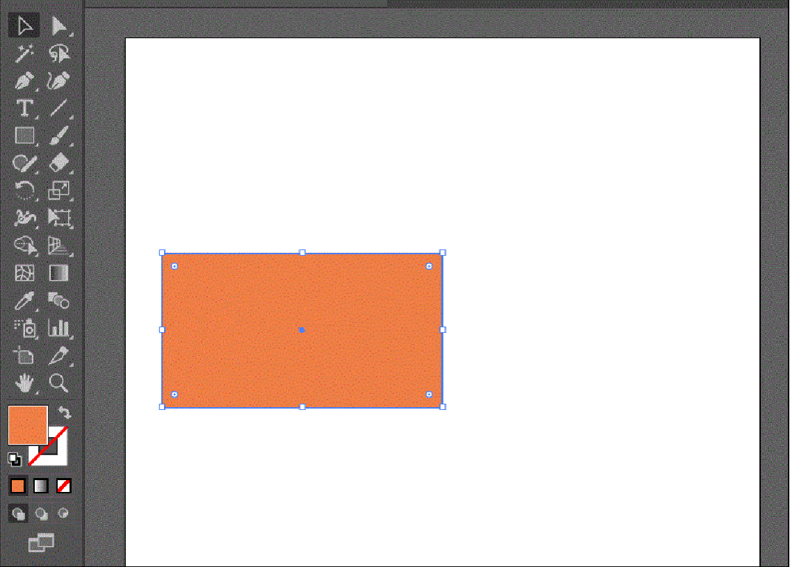
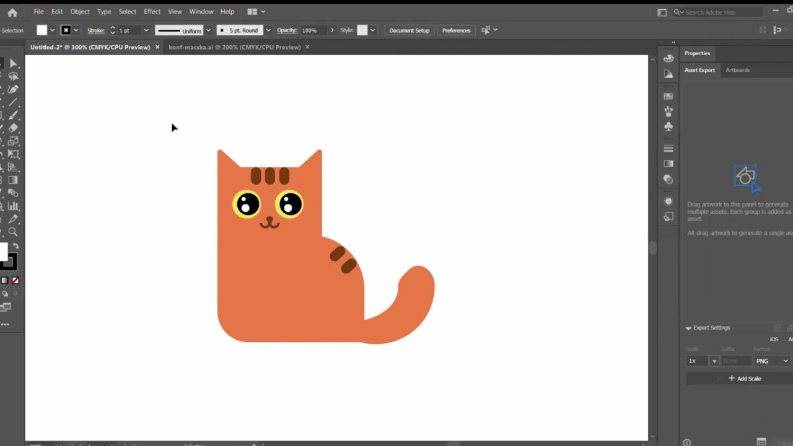
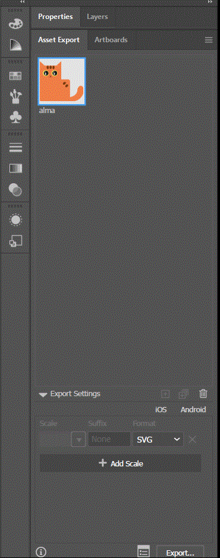

# Illustrator kezdő

## YouTube videó

    <iframe width="560" height="315" src="https://www.youtube-nocookie.com/embed/TlHprUn9FTo" title="YouTube video player" frameborder="0" allow="accelerometer; autoplay; clipboard-write; encrypted-media; gyroscope; picture-in-picture" allowfullscreen></iframe>

A tanfolyam előtt mindenképp tegyétek meg a következőket:

- Szükség lesz Adobe Illustratorra, lehetőleg 2019-esre vagy azutánira, angol nyelven. Az ingyenes próbaverziót [innen](https://www.adobe.com/products/illustrator/free-trial-download.html#) letölthetitek
- Töltsétek le a kiindulási [anyagot](https://drive.google.com/file/d/1fQekplMXM3JiibNKZ6B49fJ1CaGDFLkk/view?usp=sharing)

## Házi feladat

A ház feladat egy minimalista **album cover** elkészítése. 
Mérete legyen **12cm x 12cm**. De ezen kívül semmilyen megkötés nincsen. 
Teljesen jó megoldás az is ha az órán készített elemeket használják fel, de ez ne szabjon határt a kreativitásotoknak. 
Ha igazán próbára akarjátok tenni magatokat, akkor ez egy remek lehetőség, hogy valami újat alkossatok. 
A cover-re nem kell feliratot tennetek, de ha akarnátok egyáltalán nem nehéz: a bal oldali tool bar-ban a type tool-t kell megkeresnetek (egy T-betű a jele és a gyorsbillentyűje is "t")

### Ami még fontos a házival kapcsolatban

- 2 hetetek van az elkészítésére (azaz márc. 23-án van a határidő)
- hazi@schdesign.hu címre kell küldeni a munkákat a kövi információkkal együtt:
    - Beleegyeztek, hogy az elkészült munkát megosszuk a közösségi platformjainkon?
    - Ha igen, milyen névvel vagy névtelenül? Esetleg ha insta profillal, akkor küldjétek el nekünk a profilotok linkjét

### Visszajelzés

Az alábbi [form](https://forms.gle/8Yd1szgYY1wNkoZp9)-on lehetőségetek van visszajelzést küldeni a tanfolyamokról, mi az, ami tetszett bennük és miben tudnánk még fejlődni.

Minden kitöltést előre is köszönünk!

## Hasznos tanácsok kezdő illusztrátorosoknak

Az illustrator használata korántsem egyértelmű, viszont könnyen tanulható :')  
A következőkben a program pár alapvető funkciójával fogunk megismerkedni

### Navigálás

Talán a legfontosabb funkció a navigálás

- Zoomolni a bal alsó nagyító ikon segítségével is lehet, de mégis sokkal könnyebb és kézenfekvőbb az ++alt++ + görgő kombinációja 
- Mozogni a vásznon a ++space++ + jobb klikk

### Layers, rétegek

Mint sok más program az illustrator is réteges felépítéssel rendelkezik. A rétegek egymás alá, fölé helyezkednek el. A különböző rétegek használata igen ajnálott, főleg komplexebb munkák során. A rétegeket tudjuk zárolni a lakat ikonnal, ilyenkor nem lehet őket átmenetileg módosítani (feloldásához, ugyanúgy a lakatra kell kattintani ) és tudjuk láthatatlanná tenni a szem ikon segítségével.

### Selection Tool VS. Direct Selection Tool

A két leggyakrabban használt eszköz az illustratorban.
A selection toollal mozgatni, átméretezni, forgatni tudjuk az alakzatot.  

Míg a direct selection tool arra való, hogy az alakzatot alkotó pontokat módosítsuk. Mint pl az egyik sarkát arrébb mozgassuk vagy lekerekítjük azt

### Exportálás

#### A meglévő elemek kiexportálása:

1. Jelöljük ki az alakzatokat, majd ++alt++ + jobb klikk segítségével mozgassuk át az **Assets Export** panelra.

2. ezután exportáljuk ki a kívánt formátumba, pl SVG-be

#### Artboard kiexportálása

A vászon kiexportálását az **File** menü **Export** azon belül **Export for screen** almenüpontjában találjuk meg

### Artboard

Ha szeretnék az artboard méretét változtatni azt az **Artboard tool** segítségével tudjuk megtenni.

- Így manuálisan tudjuk a kívánt méretre szabni a vásznat

- Vannak előre definiált méretek is amik közül tudunk választani. Ilyen pl. az amikor az artboardod olyan méretűre vágjuk, hogy az még épp be tudja foglalni a rajta elhelyezett alakzatokat.

- De be tudunk állítani egyedi méretet is. Ezt az **Artboards** ablakban a megfelelő artboardot kiválasztva a more oprtion fülnél tudjuk megtenni 

### Egyéb hasznos funkció:

#### Trim view

Ha zavarnak az artboard-ról lelógó alakzatok, akkor keressük ki a **View** menüből a **Trim view** almenüpontot. Ekkor csak az artborad-okon lévő alakzatokat látjuk. De érdemes megjegyezni, hogy minden ami lelógott nem vágódik le, hanem megmarad és csak nem látható a felhasználó számára (hacsak nem húzok az artboardra) 

#### Perspective tool

Ez egy-két esetben igen hasznos eszköz, viszont inkább most beszéljünk arról, hogyan tudjuk kikapcsolni, ha véletlenül az eszközök végigpróbálgatása közben bekapcsoltuk volna és nem tudjuk eltűntetni. Ilyenkor az ++shift+ctrl++ + **I** gomb kombinációval megtehetjük ezt meg.
