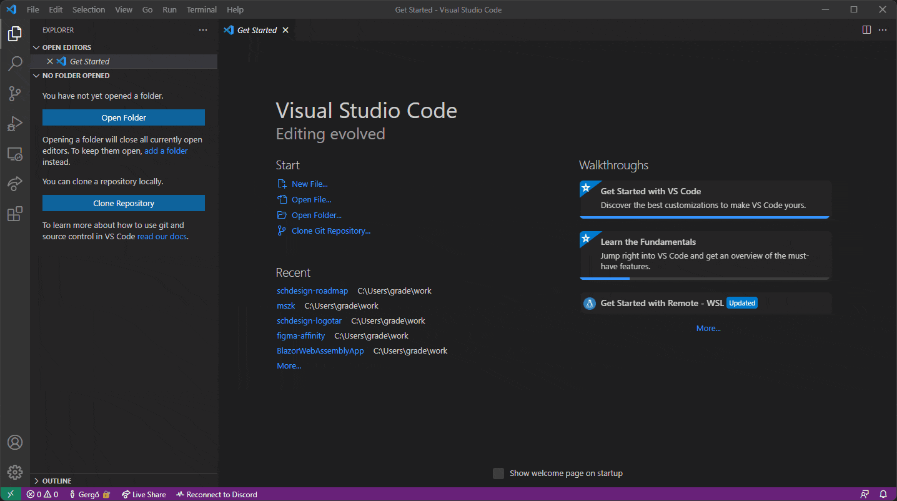

# Visual Studio Code

A Visual Studio Code *(vscode)* egy ingyenes forráskód szerkesztő a Microsofttól, amivel könnyedén lehet többek közt modern weboldalakat készíteni. Támogatott platformok: :fontawesome-brands-windows: Windows, :fontawesome-brands-apple: Mac, :fontawesome-brands-linux: Linux.

Főbb tulajdonságok:

- Kevés helyet foglal
- Kevesebb erőforrást használ, mint egy IDE
- IntelliSense támogatás
- Git támogatás
- Kiegészítők telepítése
- Integrált terminál ablak
- Nagyon jól személyre szabható
- Beállítások, kiegészítők szinkronizálása

## Letöltés

Telepíthetjük a hivatalos weboldalon elérhető telepítők egyikével: https://code.visualstudio.com/download

Vagy pl. Windows-on PowerShellben az alábbi parancs kiadásával:

```powershell
winget install --id Microsoft.VisualStudioCode
```

## Elindítás

Elindítani vagy az alkalmazás ikonra kattintva tudjuk, vagy a parancssorból az alábbi parancsok egyikével:

```powershell
# Megnyitás
code

# Konkrét mappa megnyitása:
code <mappa neve>

# Jelenlegi mappa megnyitása:
code .
```

## Kezelőfelület áttekintése

Először megnyitva valami ehhez hasonló kép fog fogadni bennünket:

<figure>
    
</figure>

### Toolbar

Bal fent található meg. Többek közt innen is tudunk műveleteket végezni.

<figure>
    
</figure>

### Activity Bar

Bal legszélen található gombok összessége. Nézetek közt tudunk váltani. Legfelül az Explorer ablakot tudjuk megnyitni, amiben láthatjuk az éppen megnyitott mappa tartalmát.

<figure>
    
</figure>

### Side Bar

Az Activity Barban kijelölt elemnek az ablaka itt nyílik meg.

<figure>
    
</figure>

### Status Bar

Az ablaknak az alsó sávjában található meg. Láthatjuk sor hanyadik karakterénél járunk, az indentálás stílusát, a fájlnak a kódolását stb.

<figure>
    
</figure>

### Minimap

Megnyitott fájl esetén jobb fent tudjuk megtekinteni. Linter használata esetén kiemeli a *"rossz"* sorokat.

<figure>
    
</figure>

### Command Palette

<figure>
    
</figure>

Az egyik legfontosabb része a vscode-nak. Megnyitni a ++ctrl+shift+p++ kombinációval tudjuk. Lényege, hogy az ezernyi parancs között könnyedén tudunk keresni, újakat felfedezni.

## Integrált terminál

Az egyik nagy előnye a vscode-nak, hogy képes a saját ablakában megnyitni egy terminált, ezzel elkerülhetővé válik sok felesleges ++alt+tab++ nyomogatás és így egy ablakban láthatunk mindent.

Többféleképpen is meg lehet nyitni:

=== "Lentről"
    
=== "Toolbarból"
    
=== "Command Palette-ből"
    

Ezen felül ha nem elég nekünk 1 terminál ablak, akkor egy újat is megnyithatunk.

## Fontosabb gyors gombok

| Kombináció | Eredmény |
| - | - |
| ++ctrl+n++ | Új fájl megnyitása |
| ++ctrl+f++ | Keresés a jelenleg megnyitott fájlban |
| ++ctrl+shift+f++ | Keresés a megnyitott mappának az összes fájljában |
| ++ctrl+tab++ | Megnyitott fájlok között váltás |
| ++shift+alt+f++ | Fájl formázása |
| ++ctrl+p++ | Fájl megnyitása a jelenlegi mappában |
| ++ctrl+shift+p++ | Command Palette megnyitása |

## Beállítások

Bal lent a :material-cog: ikonra kattintva érhetjük el. Alapból az UI nézete nyílik meg, de ha ez nem tetszik, akkor jobb fent áttudunk váltani a JSON nézetre.


## Kiegészítők

Alapból elég kevés dolgot támogat a vscode, de ezen könnyedén lehet javítani különböző kiegészítők telepítésével.


### Ajánlott kiegészítők

Az alábbi lista egy személyes preferencia, emiatt nem biztos, hogy mindenre szükséged lesz belőle, de ajánlott ezeket megnézni:

- **Auto Rename Tag** - Szinkronban tartja a záró taget a nyitó taggel
- **Better Comments** - Színesebbek lesznek bizonyos kommentek
- **ESLint** - ESLint támogatás hozzáadása a szerkesztőhöz
- **Git Graph** - Gráfszerű megjelenését teszi lehetővé a git reponak.
- **GitLens — Git supercharged** - Vizualizálja a módosításokat a forráskódban (pl. Ki csinálta, mi volt a commit szövege, mikor stb.)
- **HTML CSS Support** - A HTML és CSS nyelvek támogatását teszi lehetővé
- **IntelliSense for CSS class names in HTML** - A mappában elérhető CSS fájlok alapján ajánl osztályneveket
- **Prettier - Code Formatter** - Könnyű formázását teszi lehetővé a forráskódnak
- **SVG** - SVG támogatás hozzáadása a szerkesztőhöz
- **Tailwind CSS IntelliSense** - Tailwind osztályneveket fog tudni ajánlani a szerkesztő
- **YAML** - YAML támogatás hozzáadása a szerkesztőhöz

Ezen felül számtalan másik kiegészítővel tudjuk jobban személyre szabni az élményt, más nyelvek támogatása, témák használata, ikonok lecserélése stb.
