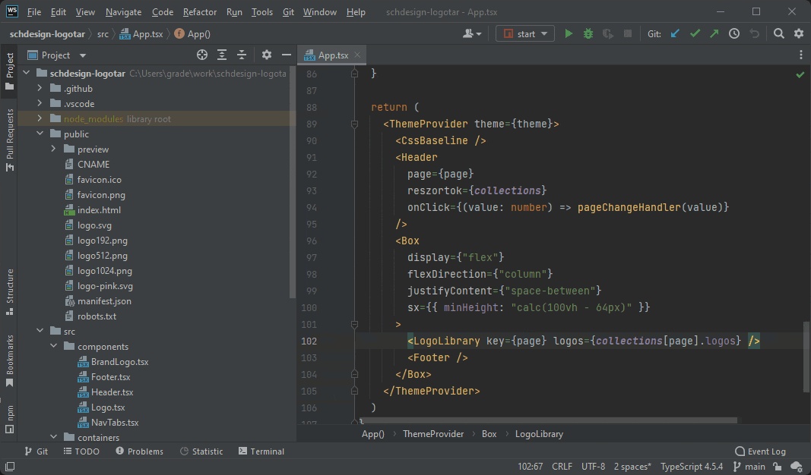

# WebStorm

A WebStorm egy fizetős IDE a JetBrains-től. Segítségével könnyedén lehet kisebb, nagyobb JavaScript alapú projekteket készíteni. Rengeteg webfejlesztéshez használt technológiát out-of-the-box támogat, viszont kevésbé lehet testre szabni.

Főbb tulajdonságok:

- Alapértelmezett támogatása webfejlesztéshez használt nyelveknek
- Beépített ESLint támogatás
- Verziókezelés támogatás
- Kiegészítők telepítése
- Integrált terminál ablak
- Beállítások, kiegészítők szinkronizálása

## Beszerzése

### Education változat

Más JetBrains-es termékekhez hasonlóan, ezt is be lehet szerezni ingyenesen **\@edu.bme.hu** vagy **\@sch.bme.hu** email címmel.

Az alábbi linken tudsz igényelni egy ingyenes változatot diákként: https://www.jetbrains.com/community/education/#students

### Toolbox

Ajánlott a Toolbox alkalmazáson keresztül letölteni. Ennek a legnagyobb előnye, hogy kvázi alkalmazásboltként viselkedik, egy helyről tudjuk kezelni az összes JetBrains-es terméket, letölteni, frissíteni, letörölni.

Ezen felül, ha majd szinkronizálni szeretnénk a beállításainkat és letöltött kiegészítőinket, akkor elég csak a Toolboxban bejelentkezni, nem kell minden egyes alkalmazásban egyesével belépni.

Ezt itt tudod letölteni: https://www.jetbrains.com/toolbox-app/

Letöltés és elindítás után egy ehhez hasonló ablak fog fogadni:

<figure>
    
</figure>

Innen válasszuk ki a WebStormot és telepítsük fel.

A WebStormot elindítva valami hasonló ablak fog minket választani:

<figure>
    
</figure>

## Kezelőfelület áttekintése

Egy projektet megnyitva egy ehhez hasonló ablak fogad majd minket:

<figure>
    
</figure>

### Toolbar

Bal fent található meg. Többek közt innen is tudunk műveleteket végezni.

<figure>
    
</figure>

### Projekt fájlok

A megnyitott projekt fájljait találhatjuk meg itt.

<figure>
    
</figure>

### Status bar

Az ablaknak az alsó sávjában található meg. Láthatjuk sor hanyadik karakterénél járunk, az indentálás stílusát, a fájlnak a kódolását stb.

<figure>
    
</figure>

## Integrált terminál

A status bar feletti Terminal gombra kattintva tudjuk megnyitni.

## Kiegészítők

Kiegészítőket a beállításokból tudunk letölteni.

